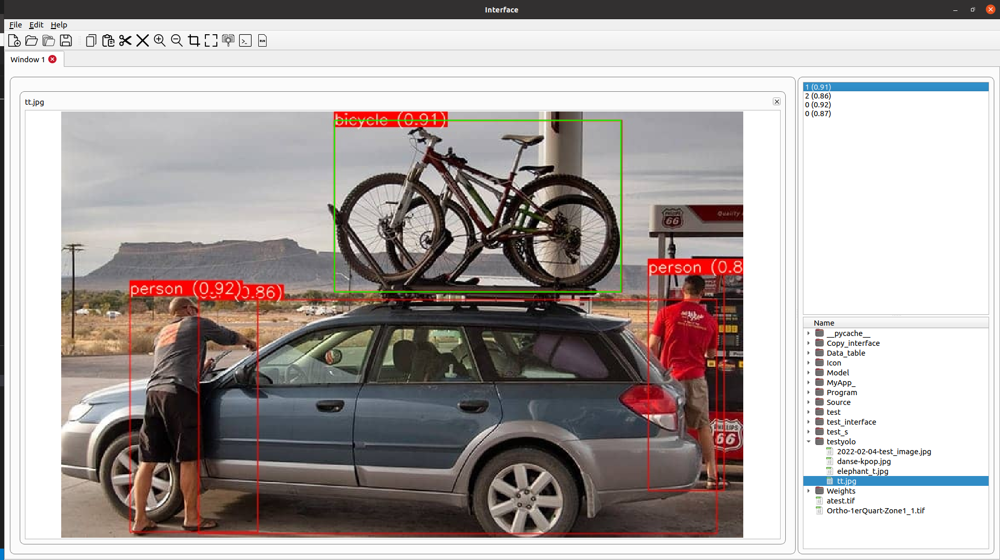

## Interface Graphique



## Description

 L'application est un environnement graphique qui permet de réaliser des analyses d'images à l'aide d'algorithmes de détection d'objets et de segmentation. L'interface offre une expérience conviviale pour charger des images, choisir les algorithmes à utiliser, et visualiser les résultats.

## Fonctionnalités
 
- Chargement et analyse d'images de type satellite
- Possibilité d'utiliser différents algorithmes de détection d'objets et de segmentation pour analyser les images chargées.
- Affichage des résultats d'analyse sur une interface conviviale.

## Configuration requise


Voici la configuration requise pour utiliser l'application :

    Python version 3.10 ou plus
    PyTorch 2.0 ou plus
    OpenCV (opencv-python-headless)
    PyQt5
    UltralyticsV8

Exemple d'installation avec conda :

Créez un environnement virtuel avec Python 3.10 en utilisant Conda :

    conda create -n myenv python=3.10

Activez l'environnement virtuel :

    conda activate myenv

Installez les bibliothèques requises :


    conda install pytorch torchvision torchaudio cpuonly -c pytorch
    pip install opencv-python-headless
    pip install qtpy ultralyticsV8

Lors de l'importation de cv2 (OpenCV), ajoutez les lignes suivantes pour éviter les erreurs avec PyQt5 :

```python
import os, sys
ci_build_and_not_headless = False
try:
    from cv2.version import ci_build, headless
    ci_and_not_headless = ci_build and not headless
except:
    pass
if sys.platform.startswith("linux") and ci_and_not_headless:
    os.environ.pop("QT_QPA_PLATFORM_PLUGIN_PATH")
if sys.platform.startswith("linux") and ci_and_not_headless:
    os.environ.pop("QT_QPA_FONTDIR")
```
## Comment utiliser l'interface

1. Téléchargez le code source et installez les dépendances nécessaires.

2. Lancez l'application en exécutant le fichier "main.py".


## Documentation

Vous pouvez trouver la documentation complète de l'application dans les fichiers suivants :

- [Manuel d'utilisation (PDF)](Help/Manuelle_utilisation.pdf)
- [Documentation de Classe (PDF)](Help/Class_Documentation.pdf)

## Auteurs

    Arthur Courtrai 

## Licence

Ce projet appartient au laboratoire IRISA


